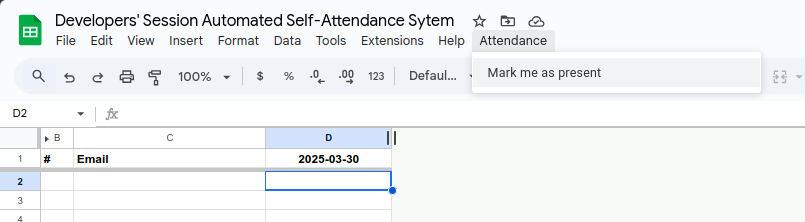

_One-click Attendance with google sheet. disallow users to make changes directly and allow only through appscript._

_If user makes any change, attempt to undo the change back to appscript's last changes._

Hardcoaded to accept registration only on sunday 3PM

 

### Usage:
- run flask app.
- keep flask's ip:port in code.js and install it on a google spreadsheet
- add onopen and onedit trigger for the app script
